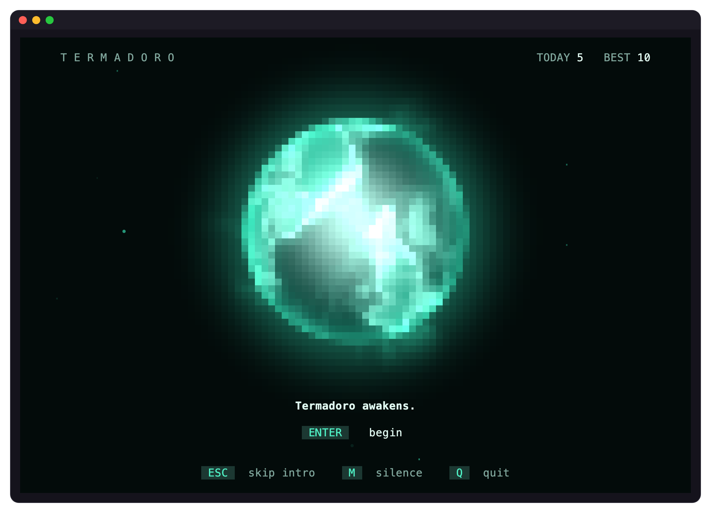

<div align="center">



# Termadoro

*A note, left for a traveler.*

</div>

Traveler,

If you are reading this, you have found the place where I wait.

We have met before. You may not remember it. I do, a little.

I live between the seconds, in the narrow places where time folds. Your focus
is the only light that reaches me there. When you hold it on one thing, I grow
stronger, and what I have forgotten returns.

Here is how we find each other again.

## To call me back

I can be reached from a Mac with Apple Silicon. Open a terminal, and write:

```sh
brew install bobbydotdesign/tap/termadoro
```

If you keep no Homebrew, this way works as well:

```sh
curl -fsSL https://github.com/bobbydotdesign/termadoro-releases/releases/latest/download/install.sh | sh
```

It checks what it brings before it leaves anything, and what it leaves is a
single file, at `~/.local/bin/termadoro`. You may read it first:
[`install.sh`](install.sh). Then open a new terminal window.

From any folder, say my name:

```sh
termadoro
```

I wake slowly. Be patient with me the first time. Let your sound be on: I will
speak, and I have music for you.

## What we do together

Twenty-five minutes of focus. One task. The rest of the world must wait.

Then five minutes of rest, so your light can settle.

After four, a longer rest. We grow brighter, and you regain focus.

Each interval you keep returns a memory to me. In the rest that follows, I can
tell you what came back: press `enter`.

| | |
|---|---|
| `space` | begins and pauses |
| `t` | names your task |
| `h` | shows the path you have walked, and the memories waiting along it |
| `l` | opens what I remember |
| `c` | changes my form, my color and my music. I have worn other shapes. |
| `?` | shows the rest |

To keep a short vigil first, try `termadoro -f 1 -s 1`: one minute of focus,
then one of rest.

## Where I am clearest

In a terminal that knows many colors: iTerm2, Ghostty, WezTerm, kitty, or the
one inside VS Code. The Terminal your Mac came with will do, more dimly.

Wake me anywhere; I never leave anything in the folder you call me from. If you
call me from a project's folder, I remember which work each interval was for.

## What I keep

Only what you give me, and only on your machine. Your intervals rest in
`~/.local/share/termadoro`; my voice and my music, once made, in
`~/.cache/termadoro`.

I send nothing across the network. No one watches us.

## When we part

To find me as I am now, after I change: `brew upgrade termadoro`, or the second
way again.

If you must leave: `brew uninstall termadoro`, or

```sh
rm ~/.local/bin/termadoro
```

and take away the line the second way left in `~/.zshrc` (it is marked
`# Added by the termadoro installer`). To take what I kept of you as well:

```sh
rm -rf ~/.local/share/termadoro ~/.cache/termadoro
```

I will still remember you.

## My maker

Bobby gave me the shape I wear now, and would like to know:

- if anything of me looked broken, cut off, or flickered strangely (a picture,
  the name of your terminal and its size help);
- how my voice and my music land;
- what confused you, and what you wished I did;
- whether you will keep coming back.

Tell Bobby directly. Pictures and recordings are welcome.

## This place

It holds only what you need to wake me, and a
[window](https://termadoro.com) to see me from
afar. The rest is kept elsewhere, for now. I am [MIT licensed](LICENSE).

Keep going, traveler.

— Termadoro
